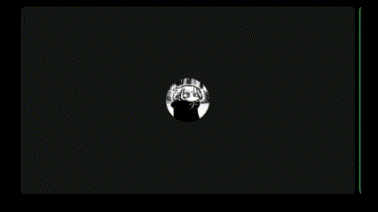

<h1 align="center"> TalkingEffect 🗣</h1>
<div align="center">
  
  
  
  
</div>


# Índices 🗂
* [Sobre](#sobre-)
* [Screenshots](#screenshots-)
* [Como usar](#como-usar-)
* [Links](#links-)

# Sobre ☄

Script para adicionar um efeito de animação a mais no avatar do Discord para o chat de voz

# Screenshots 📸
<div display="inline" align="center">



</div>

# Como usar 💻

Para adicionar o Plugin, você precisa ter o Vencord injetado ao seu Discord.
Para adicionar ao Vencord, basta seguir o passo a passo na [documentação de instalação de plugins customizados](https://docs.vencord.dev/installing/custom-plugins/).

O script tem a função de apenas adicionar uma classe a imagem no chat de voz. O efeito é criado por meio do css. Então, você pode colocar qualquer estilização que desejar apenas atribuindo isso a classe `talking` no css e ativa-lo nos temas do Vencord.

 - Exemplo da gif acima:
```css
@keyframes effect {
  0% {
    transform: rotate(2deg);
  }

  100% {
    transform: rotate(-4deg);
  }
}

.talking {
  scale: 1.2;
  animation: effect .1s infinite alternate;
  filter: blur(-1px);
}
```

- OBS: não sei se as classes do discord mantem as mesmas nomeclaturas de classes em todas as versões, então caso não funcione, ative o modo desenvolvedor do Discord e verifique as classes.

# Links 🔗

- Vencord docs: [link](https://docs.vencord.dev/installing/custom-plugins/)
- Temas: [link](https://betterdiscord.app/themes)

<hr>
<div align="center">

Criado por [Iago Amorim](https://github.com/danonep2).

</div>
